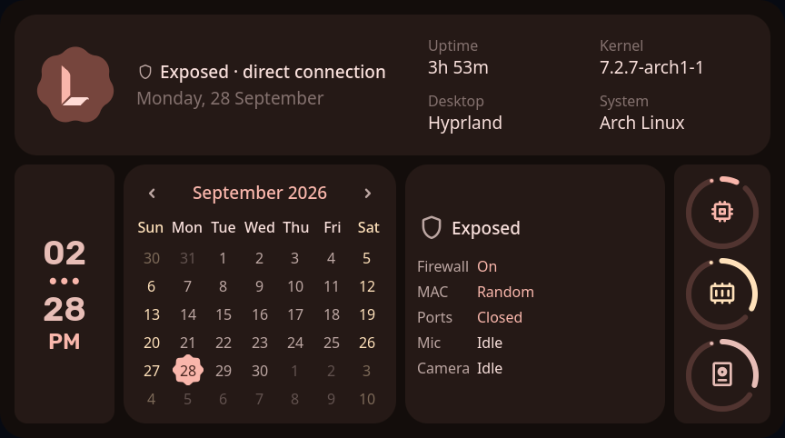
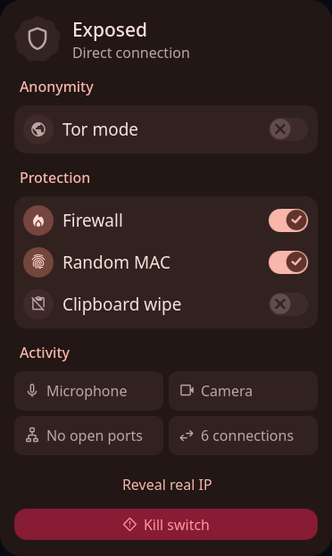
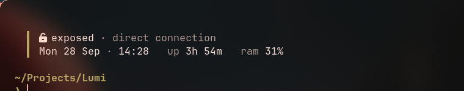

<p align="center"></p>

<h1 align="center">Lumi</h1>

<p align="center">A quiet, private desktop for Arch Linux, built on Hyprland.</p>

<p align="center">
  
  
</p>

Lumi is a complete desktop: the [Lumi shell](https://github.com/void193/LumiShell) (bar, launcher,
dashboard, notifications, lock screen, settings) plus a tuned Hyprland, terminal and prompt, all
coloured from your wallpaper. This repository installs all of it on a fresh Arch Linux.

- **Privacy built in:** a shield in the bar shows if you're exposed or protected. One panel gives
  you Tor mode with automatic IP rotation, a firewall, random MAC address, clipboard wiping, mic and
  camera indicators, and a kill switch.
- **Clean and fast:** a numbered, fixed set of workspaces, a launcher with calculator, SSH, hashing
  and command runner, a memory **Clean** button that never closes your open apps without asking.
- **Anonymous by default:** no name or photo on the lock screen, notifications hidden while locked,
  no weather or lyrics lookups phoning home.

---

## Contents

1. [What you need](#1-what-you-need)
2. [Make a bootable USB](#2-make-a-bootable-usb)
3. [Boot the Arch installer](#3-boot-the-arch-installer)
4. [Connect to the internet (installer)](#4-connect-to-the-internet-installer)
5. [Install Arch with archinstall](#5-install-arch-with-archinstall)
6. [First boot: connect to Wi-Fi](#6-first-boot-connect-to-wi-fi)
7. [Install Lumi](#7-install-lumi)
8. [Start Lumi](#8-start-lumi)
9. [Using Lumi](#9-using-lumi)
10. [Updating](#10-updating)
11. [Troubleshooting](#11-troubleshooting)
12. [Uninstalling](#12-uninstalling)
13. [Credits](#13-credits)

---

## 1. What you need

- A 64-bit PC or laptop (Intel/AMD). 8 GB RAM recommended; 4 GB works.
- A USB stick of **2 GB or more** (it will be erased).
- **Internet**: Wi-Fi or an ethernet cable. The installer downloads about 1.5–2 GB.
- About **30–60 minutes**. Lumi's installer compiles a couple of parts, so a slow machine takes longer.
- Back up anything important on the target disk. Installing Arch erases it.

## 2. Make a bootable USB

1. Download the latest Arch ISO from **<https://archlinux.org/download/>** (pick a mirror near you,
   file `archlinux-YYYY.MM.DD-x86_64.iso`).
2. Write it to the USB stick:
   - **Windows:** use [Rufus](https://rufus.ie) (select the ISO, keep defaults, choose *DD image mode*
     if asked) or [Ventoy](https://www.ventoy.net).
   - **macOS / Linux:** use [balenaEtcher](https://etcher.balena.io), or from a Linux terminal:
     ```sh
     lsblk                                  # find your USB, e.g. /dev/sdb (NOT a partition like sdb1)
     sudo dd if=archlinux-*.iso of=/dev/sdX bs=4M status=progress oflag=sync
     ```
     Double-check `/dev/sdX`. Writing to the wrong disk destroys its data.

## 3. Boot the Arch installer

1. Plug the USB in and restart.
2. Open the boot menu while the logo shows. The key depends on the brand:
   `F12` (Dell, Lenovo, Acer), `F9` (HP), `Esc` / `F8` (ASUS), `F11` (MSI), `F12` or `F2` (others).
3. Choose the USB stick (it may be listed as **UEFI: \<USB name\>**; prefer the UEFI entry).
4. If it refuses to boot, enter the firmware setup (`F2` / `Del`) and **disable Secure Boot**, then try again.
5. Pick **Arch Linux install medium**. You'll land at a `root@archiso ~ #` prompt.

## 4. Connect to the internet (installer)

**Ethernet** works on its own. Skip to the check at the end.

**Wi-Fi** uses `iwctl`:

```sh
iwctl
```

Then inside iwctl (your device is usually `wlan0`; `device list` shows the real name):

```
device list
station wlan0 scan
station wlan0 get-networks
station wlan0 connect "Your Wi-Fi Name"
exit
```

It asks for the password after `connect`. Names with spaces need the quotes.

**Check it works:**

```sh
ping -c 3 archlinux.org
```

You should see replies. If not:

| Problem | Fix |
|---|---|
| `device list` shows nothing or the device is *powered off* | `rfkill unblock all`, then in iwctl `device wlan0 set-property Powered on` |
| `Operation not permitted` / wrong password | Retype it; passwords are case-sensitive |
| Connected but `ping` fails | Wait 10 seconds and retry; then `ping -c 3 1.1.1.1` (if that works, DNS is slow: retry the first ping) |
| Still nothing | Use your phone: USB tethering shows up like ethernet |

## 5. Install Arch with archinstall

Run the guided installer:

```sh
archinstall
```

Use the arrow keys, `Enter` to open an item, and `Esc` to go back. Set these (anything not listed can stay as it is):

| Menu item | Choose |
|---|---|
| **Mirrors** | *Mirror region* → your country (faster downloads) |
| **Disk configuration** | *Partitioning* → *Use a best-effort default partition layout* → pick your disk → **ext4** (simple) or btrfs |
| **Bootloader** | *Systemd-boot* (or *Grub* if you dual-boot Windows) |
| **Hostname** | any name, e.g. `lumi` |
| **Authentication** → *Root password* | set one and remember it |
| **Authentication** → *User account* | add your user, set a password, and answer **Yes** to *superuser (sudo)* |
| **Profile** | *Type* → **Minimal** (Lumi installs its own desktop) |
| **Applications** | *Audio* → **Pipewire**, *Bluetooth* → **enabled** |
| **Network configuration** | **Use NetworkManager** ← important, Lumi's Wi-Fi controls need it |
| **Additional packages** | type `git` |
| **Timezone** | your timezone |

Choose **Install** and confirm. When it says it's done, answer **No** to chrooting, then:

```sh
reboot
```

Remove the USB stick when the screen goes black.

## 6. First boot: connect to Wi-Fi

Log in with **your user** (not root) at the `login:` prompt. There's no desktop yet, just text.

**Ethernet** works on its own. For **Wi-Fi**:

```sh
nmcli device wifi list
nmcli device wifi connect "Your Wi-Fi Name" password "your-password"
```

Or use the menu version: `nmtui` → *Activate a connection*.

**Check it works:**

```sh
ping -c 3 archlinux.org
```

If `nmcli` says *NetworkManager is not running*:

```sh
sudo systemctl enable --now NetworkManager
```

The Lumi installer can also connect you to Wi-Fi itself if you're offline when you run it.

## 7. Install Lumi

```sh
git clone https://github.com/void193/Lumi.git
cd Lumi
./install.sh
```

(If `git` is missing: `sudo pacman -S git`.)

What the installer does, in order. It's safe to run again if anything fails halfway:

1. Checks the system and your `sudo` access, and **connects to Wi-Fi** if you're offline.
2. Updates the whole system (avoids broken partial upgrades).
3. Installs Hyprland, audio, network, bluetooth, fonts, the terminal and apps from the official repos.
4. Installs **yay** (an AUR helper) and builds the AUR packages. `quickshell-git` compiles from
   source, so give it a few minutes.
5. Builds and installs the **Lumi shell** and the `lumi` command.
6. Installs the configuration (Hyprland, foot, fish, starship, Qt theme, Lumi settings).
   Anything already there is copied to `~/.config/lumi-backup-<date>/` first.
7. Puts the Lumi wallpaper in `~/Pictures/Wallpapers`.
8. Enables Wi-Fi (NetworkManager), Bluetooth and power profiles.
9. Asks three questions:
   - **Use fish as your shell?** Yes is recommended; the prompt is designed for it.
   - **Start Lumi automatically after login?** Yes means you log in and the desktop starts.
   - **Set up Tor mode and the firewall?** Optional. You can run `sudo lumi-tor-setup` later.

Options: `./install.sh --yes` accepts every default, `--no-autostart`, `--no-fish`, `--tor`.
Everything is logged to `~/lumi-install.log`.

## 8. Start Lumi

```sh
reboot
```

Log in on the first console (the one you see after booting). Lumi starts by itself if you chose
autostart. Otherwise type:

```sh
start-hyprland
```

On first start, press **`SUPER + SPACE`** and pick a wallpaper: the whole desktop recolours to match it.

## 9. Using Lumi

`SUPER` is the Windows key. Tap it alone to open the launcher.

### Essentials

| Keys | Action |
|---|---|
| `SUPER` (tap) | Launcher: apps, and `>` for commands |
| `SUPER + SPACE` | Wallpaper picker |
| `SUPER + T` / `W` / `E` / `C` | Terminal / browser / files / editor |
| `SUPER + Q` | Close window |
| `SUPER + F` | Fullscreen |
| `SUPER + ALT + SPACE` | Float / unfloat window |
| `SUPER + 1…5` | Go to workspace |
| `SUPER + ALT + 1…5` | Move window to workspace |
| `SUPER + scroll` or `SUPER + PageUp/PageDown` | Previous / next workspace (wraps around) |
| `ALT + TAB` | Cycle windows |
| `SUPER + L` | Lock |
| `CTRL + ALT + DELETE` | Session menu (lock, log out, restart, shut down) |
| `SUPER + N` | Notifications |
| `SUPER + K` | Show all panels |
| `SUPER + V` / `SUPER + .` | Clipboard history / emoji picker |
| `Print` / `SUPER + SHIFT + S` | Screenshot / screenshot a region |
| `SUPER + SHIFT + C` | Colour picker |
| `SUPER + D` / `M` / `S` | Chat / music / scratch overlay (special workspaces) |
| `SUPER + SHIFT + ESCAPE` | **Kill switch**: network off, clipboard wiped, locked |
| `CTRL + SUPER + ALT + R` | Restart the shell |

Touchpad: **4-finger swipe** left/right changes workspace; **3-finger swipe up** opens the scratch overlay.

### Privacy

Hover the **shield** at the bottom of the bar:

- **Tor mode** sends Firefox (and any app that uses the system proxy) through Tor. Pick
  *Rotate identity* every 5, 15 or 30 minutes, or press the refresh button, for a new exit IP.
  Needs `sudo lumi-tor-setup` once.
- **Firewall** blocks unsolicited incoming connections (browsing, downloads and games keep working).
- **Random MAC** gives your Wi-Fi card a random hardware address (reconnects once).
- **Clipboard wipe** clears anything you copy after 45 seconds.
- **Activity** lights up red if an app uses your mic or camera, or a port is open to the network.
- **Kill switch** turns the network off, wipes the clipboard and locks the screen.

### Terminal



foot with fish and a quiet two-line prompt: folder and git status on the left, a shield on the right
while you're on Tor or a VPN, and a `❯` that turns red when a command fails.

Shortcuts: `newid` (new Tor identity), `torip` (IP sites see through Tor), `myip` (your real IP),
`killswitch`.

Only apps that follow the system proxy use Tor mode. Terminal tools and most games don't.

### Launcher commands

Type `>` in the launcher:

| Command | Does |
|---|---|
| `>calc 2^10` | Calculator |
| `>run htop` | Run a command in a terminal (or in the background) |
| `>ssh` | Connect to hosts from `~/.ssh/config` and `known_hosts`, or type `user@host` |
| `>enc text` | base64, hex, URL encoding, sha256, sha1, md5 (`Enter` copies) |
| `>wallpaper` | Wallpapers (also `SUPER + SPACE`) |
| `>scheme` / `>variant` | Colour scheme and style (try `lumi` → *void*, *ghost*, *phosphor*, *terminal*) |

### Memory clean-up

Dashboard (`SUPER + K`) → **Performance** → **Clean**. It lists heavy apps; nothing closes until you
press **Clean now**, and apps with open windows are never picked for you.

### Where things live

| Path | What |
|---|---|
| `~/.config/lumi/shell.json` | Lumi settings (also editable in the Settings app) |
| `~/.config/lumi/hypr-user.lua` | **Your** Hyprland additions (monitors, keyboard layout, extra binds): kept on updates |
| `~/.config/lumi/hypr-vars.lua` | Override variables like apps or keybinds (e.g. `return { browser = "chromium" }`) |
| `~/.config/hypr/` | Lumi's Hyprland config (replaced on reinstall; put changes in the two files above) |
| `~/Pictures/Wallpapers` | Wallpapers (videos go in `~/Pictures/Live-Wallpapers`) |

## 10. Updating

```sh
sudo pacman -Syu          # system
yay -Syu                  # system + AUR packages
cd ~/Lumi && git pull && ./install.sh   # Lumi itself (your old configs are backed up again)
```

## 11. Troubleshooting

Start here for anything odd: **`lumi shell -l`** shows the shell's log, and
**`hyprctl configerrors`** shows Hyprland config errors.

<details>
<summary><b>No internet after installing</b></summary>

```sh
sudo systemctl enable --now NetworkManager
nmcli device wifi list
nmcli device wifi connect "Your Wi-Fi Name" password "your-password"
```

If Wi-Fi is "blocked" or `nmcli radio` shows it disabled:

```sh
rfkill list
sudo rfkill unblock wifi
nmcli radio wifi on
```

If iwd and NetworkManager are both running they fight over Wi-Fi: `sudo systemctl disable --now iwd`.
</details>

<details>
<summary><b>pacman: "invalid or corrupted package (PGP signature)" / keyring errors</b></summary>

```sh
sudo pacman -Sy archlinux-keyring
sudo pacman -Syu
```

If it still fails: `sudo pacman-key --init && sudo pacman-key --populate archlinux`.
</details>

<details>
<summary><b>pacman: "failed to synchronize" / downloads are very slow</b></summary>

Pick faster mirrors:

```sh
sudo pacman -S reflector
sudo reflector --latest 20 --protocol https --sort rate --save /etc/pacman.d/mirrorlist
sudo pacman -Syyu
```
</details>

<details>
<summary><b>The installer stopped halfway</b></summary>

It's safe to run again: `./install.sh`. It skips what's already done. The reason is at the end of
`~/lumi-install.log` (`tail -n 40 ~/lumi-install.log`).

If an AUR package fails to build (often `quickshell-git`), try it alone to see the error:

```sh
yay -S quickshell-git
```

Building needs RAM; close other apps, or on 4 GB machines add swap:

```sh
sudo fallocate -l 4G /swapfile && sudo chmod 600 /swapfile && sudo mkswap /swapfile && sudo swapon /swapfile
```
</details>

<details>
<summary><b>"sudo: user is not in the sudoers file"</b></summary>

Your user wasn't made a superuser in archinstall. Log in as root, then:

```sh
usermod -aG wheel yourname
EDITOR=nano visudo     # uncomment the line: %wheel ALL=(ALL:ALL) ALL
```
</details>

<details>
<summary><b>Black screen, or Hyprland won't start</b></summary>

From the text console, start it by hand to see the error: `start-hyprland`.
Its log: `cat $XDG_RUNTIME_DIR/hypr/*/hyprland.log | tail -n 50`.

- In a **virtual machine**, enable 3D acceleration (VirtualBox: VMSVGA + 3D; VMware: accelerate 3D).
- **NVIDIA:** see below.
</details>

<details>
<summary><b>NVIDIA graphics</b></summary>

For GTX 16xx, RTX and newer cards:

```sh
sudo pacman -S nvidia-open-dkms nvidia-utils linux-headers
reboot
```

Then add to `~/.config/lumi/hypr-user.lua`:

```lua
hl.env("LIBVA_DRIVER_NAME", "nvidia")
hl.env("__GLX_VENDOR_LIBRARY_NAME", "nvidia")
```

Older cards (GTX 10xx and earlier, MX series) aren't supported by `nvidia-open`; see the
[Arch Wiki NVIDIA page](https://wiki.archlinux.org/title/NVIDIA). On laptops with Intel/AMD
graphics as well, the built-in GPU runs the desktop fine without the NVIDIA driver.
</details>

<details>
<summary><b>The bar or shell doesn't show up</b></summary>

```sh
lumi shell -d        # start it
lumi shell -l        # see why it failed
```

`CTRL + SUPER + ALT + R` restarts it. If it says a module is missing, reinstall:
`cd ~/Lumi && ./install.sh`.
</details>

<details>
<summary><b>No sound</b></summary>

```sh
wpctl status                                   # is the right output the default (*)?
systemctl --user restart pipewire pipewire-pulse wireplumber
```

Many Intel laptops need the sound firmware: `sudo pacman -S sof-firmware`, then reboot.
Pick outputs with `CTRL + ALT + V`.
</details>

<details>
<summary><b>Bluetooth won't turn on</b></summary>

```sh
rfkill list
sudo rfkill unblock bluetooth
sudo systemctl enable --now bluetooth
```

Lumi's Bluetooth toggle also clears the block for you.
</details>

<details>
<summary><b>Wrong screen resolution, scaling or an external monitor</b></summary>

`hyprctl monitors` lists the screens. Add a line to `~/.config/lumi/hypr-user.lua`, for example:

```lua
hl.monitor({ output = "eDP-1", mode = "1920x1080@60", position = "0x0", scale = 1.25 })
```

External HDMI screens mirror the laptop automatically; `SUPER + SHIFT + P` switches mirror/extend.
</details>

<details>
<summary><b>Keyboard layout isn't English (US)</b></summary>

Add to `~/.config/lumi/hypr-user.lua`:

```lua
hl.config({ input = { kb_layout = "de" } })   -- your layout code: us, gb, de, fr, es, in...
```

Several layouts: `kb_layout = "us,de"` plus `kb_options = "grp:alt_shift_toggle"`.
</details>

<details>
<summary><b>Tor mode or Firewall says "Not set up"</b></summary>

```sh
sudo lumi-tor-setup
```

If websites don't change IP after *New identity*, reload the page: open connections keep their old
route until they reconnect.
</details>

<details>
<summary><b>Undo Lumi's configs</b></summary>

Every run backs up what it replaces to `~/.config/lumi-backup-<date>/`. Copy files back from there,
for example `cp -a ~/.config/lumi-backup-*/.config/hypr ~/.config/`.
</details>

## 12. Uninstalling

```sh
sudo pacman -Rns lumi-shell
rm -rf ~/.config/hypr ~/.config/lumi ~/.local/state/lumi ~/.cache/lumi
rm -f ~/.config/fish/conf.d/lumi-autostart.fish
```

and remove the `lumi-autostart` block from `~/.bash_profile`. Your backups in
`~/.config/lumi-backup-*` stay until you delete them.

## 13. Credits

Lumi is built on the work of others:

- [Caelestia](https://github.com/caelestia-dots) shell, CLI and dotfiles by soramane and contributors,
  which Lumi is forked from.
- [Caelestia Live Wallpapers Integration](https://github.com/SunnydeuS/Caelestia-Live-Wallpapers-Integration) by SunnydeuS.
- [Hyprland](https://hypr.land), [Quickshell](https://quickshell.outfoxxed.me), and the Arch Linux community.

Licensed under the GNU GPL v3.0, see [LICENSE](LICENSE).
